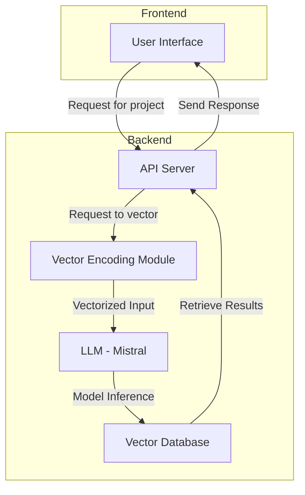

```mermaid
graph TD
    subgraph Frontend
        A[User Interface]
    end

    subgraph Backend
        B[API Server]
        C[Vector Encoding Module]
        D[LLM - Mistral]
        E[Vector Database]
    end

    A -->|Request for project| B
    B -->|Request to vector| C
    C -->|Vectorized Input| D
    D -->|Model Inference| E
    E -->|Retrieve Results| B
    B -->|Send Response| A
```

